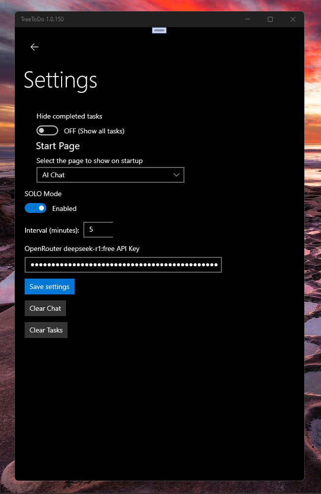
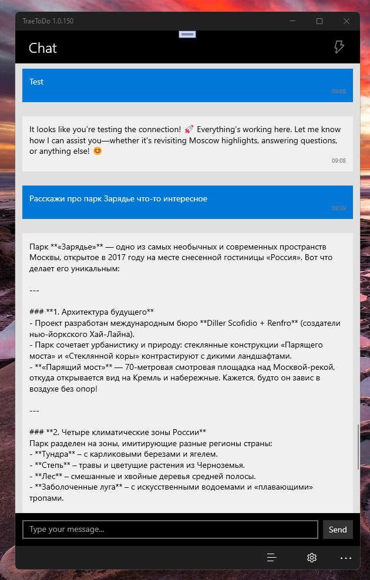

# TraeToDo 1.0.0 - main branch

Experimental ai project... simplest "Deepseek-like" UWP app created with (in) Trae Ai service for my old sweet Windows Family devices! ;) 

_CAUTION_: this app is using a free model variant (ID is deepseek/deepseek-r1:free), then it will be limited to 10 requests per minute and 100 requests per day.

## Preface
The purpose of creating this repository was to micro-explore the possibility of ultra-fast development from 0 to 1 of an entire project (solution) by auto-generating the project in the latest IDE Trae. I consider the experiment a success. It took 5 minutes to do everything about everything :) From time to time, I look for different cool alternatives (add-ons) to Visual Studio in order to bypass the limit on the number of requests to Github Copilot. As an old, non-profit, enthusiastic developer who gives the world his open-source solutions, I just want to be able to get a little help from newfangled AI.

If you are also interested in this, trae-todo (try to generate, heh!) an application yourself based on my promt (see Wiki). :)

*Note*: If you, like me, encounter a problem registering on the True website, just use some VPN client.

## Screenshot(s)

## Status
- I realized "Deepseek Free Chat" via OpenRouter "web-api service" =)
- Min. Win. OS build - 15063 (however, 10240 may be good too!))
- Draft / AI-generated proto / not for mainstream :)

## Wiki
I decided to share my dialogue with DeepSeek AI.. how to create Deepseek uwp app "template-prototype". ;)
So, look at Wiki: https://github.com/mediaexplorer74/TraeToDo/wiki/My-Dialogue-with-Trae-AI-about-Deepseek%E2%80%90like-project-autogeneration

## Known problems 
- Deepseek can't remember previous posts (sometimes or all times… idk yet)
- Some Deepseek's answers are empty (free plan limits?)
- XAML simplifications (no ai bubble aligment to left, for examle, and bad ui theme)

## ToDo
- Support markdown/rich text in responses
- Switch Min. Win. OS build to 10240 (Hello, W10M Astoria!)
- Fix Deepseek's null responses ("empty messages")
- Try to add some cool multi-agent features (image creation, etc.)))
- "Synth" this ai chat template with some multi-platform ToDo (use Uno, Xamarin Forms, or even MAUI...)))

## References
- https://www.trae.ai Trae AI site (I used IDE for Windows for VS-compatible project auto-generation!)
- https://github.com/Trae-AI/ GitHub "Trae-AI Corner" :)
- https://openrouter.ai (Registration & Openrouter API Key "getting" for Plan B)

## ..
As is. No support. RnD only. DIY.

## .
[m][e] June, 15 2025

